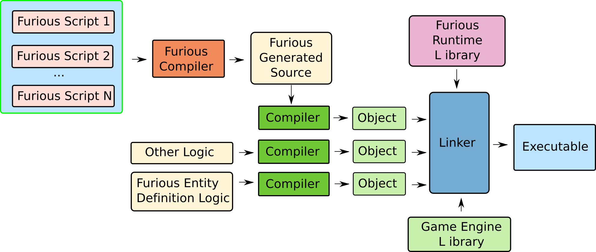

# furious
[](https://travis-ci.org/ArnauPrat/furious)

Furious is an experimental Entity Component System  (ECS) library for game engines written in C++11. As a research prototype, its main goal is to serve as a research platform to investigate the interesection of Modern database systems and Game Engines. 

## Table of Contents

* [ECS Overview](#overview)
* [Motivation](#motivation)
* [Compilation And Installation](#compilation)
* [Using Furious](#using)
* [Furious FCC Compiler](#compiler)
* [TODO](#todo)


<a name="overview"/>

## ECS Overview

Entity Component Systems, which are very popular nowadays in commercial game engines such as Unity.

[](https://www.youtube.com/watch?v=0_Byw9UMn9g)

[](https://www.youtube.com/watch?v=p65Yt20pw0g)

In entity component systems, entities, usually represented as an **id** or an **index** to one or more arrays containing the so-called **components**. A component is typically either a simple or complex data type storing a semantically undivisible pice of data. Entities are then build as a composition of components, compared to other paradigms used in game engines, where entities are typically build, for instance, using inheritance. 

For instance, a player on a First Person Shooter (FPS) game, could be build as an entity having the following components: a mesh, a transform (position, rotation, scale), a rigid-body, a health pool, a player-controller, etc.

In ECSs, components do not contain any-kind of game logic. Game Logic is expresed in separate objects or structures called **systems**. Systems, are meant to be executed on those entities fulfilling a certain condition. Typically, this condition is of the form of all entities having a subset of components. For example, a system UpdatePosition might be in charge of updating the position of all entities having a transform and a velocity component every frame.

Such a way of building entities and expressing logic, have several advantages over other paradigms traditionally used in game engines:
* Flexibility: Composition is more flexible than inheritance when it comes to build complex entities, preventing the appearance of the so-called "diamond of death".
* Data locality: Since components contain only tightly semantically related data, and systems are build to operate only on such data in a streaming fashion (tight loops), spatial locality is enforced and CPU prefetchers exploited.
* Code locality: Since the logic is stored in systems, and systems are run on all entities that qualify, code locality is achieved.

<a name="motivation"/>

## Motivation

Entity Component Systems are effectively using the Relational Model to compose the entities. The entity id or index, is the entities primary-key while components are typically stored in arrays or similar data structures indexed by the entity index. Such data structures are equivalent to tables in databases. 

In Furious, there exists a table for each different component type. Such tables, are split into blocks of a fixed size (64 entries by default) and each position of a block corresponds to an entity. Each block contains additional data such as the block offset, a bitmap to store if a given position in the block is valid, or whether the corresponding component in a position is enabled or not. 


 
On the other hand, systems can be seen as some sort of composition of a declarative select-like query plus an imperative game logic part containing the actual game update code. The select part, is the part where the system expresses the subset of entities the system applies to. For instance, in the above "UpdatePosition" example, the select part could be expressed, in natural language, as "Select all entitities having a Position and a Velocity component". Then, for all the entities resulting from such query, the imperative game logic part is executed. 

The goal of furious is to apply Database concepts such as query compilation and query optimizers to Entity Component Systems.

In traditional ECSs, the user expresses imperatively where and in which order to execute the different systems in the main game loop. For instance, execute a system that implements the AI of the enemies, another that updates all entities positions,then another one that renders those entities with a mesh, etc. The optimal system execution order (which may change as the development of the game evolves) on complex games with tens of systems and components might not be trivial, thus the user must spend time in optimizing their code, something that could be automated by a tool.

In furious, like in traditional ECSs, the code to declare and create entities is written as usual and compiled and linked with the rest of the game code. However, the systems' code is written in the so called "furious scripts". Such scripts, written in C++, are compiled all together with the Furious C++ to C++ compiler (fcc), which produces a single C++ source code file with a set of predefined functions that can be called from game's code, and which are then compiled and linked with the rest of the game and the furious runtime library.



Furious scripts are composed by two parts:
* A declarative part (the query) which specifies the entities the system should run on
* An imperative part where the logic of the system is implemented

Given a set of "furious scripts" implementing the game logic, the fcc compiler understands the declarative part (the query) of the furious scripts and for each one, creates an execution plan. Given all the execution plans, the compiler is able to merge them and produce a newly optimized execution plan using a cost model, which in turn is translated to a single C++11 src file implementing the same game logic expressed in the scripts. The optimization process's goal is to run the game logic as fast as possible by:

* minimizing the use of function calls (and no virtual calls) so the produced code is as explicit as possible to the final compiler, so it can optimize register allocation 
* place the code in tight for loops with inlined code, which opertes on aligned memory arrays to be easy to auto-vectorize by the compiler
* take advantage of common system's subqueries to reduce the amount of times the same data is fetched from memory every frame, improving data locality
* understanding dependencies between systems and their components access modes (READ or READ_WRITE), allowing for an automatic and safe parallelization of the execution plans

Additionally, thanks to the source to source furious compiler, system's code can be kept into independent modular scripts, making the code presumably more maintainable since no hand-crafted optimizations need to be performed.

The following is a simple example of a furious script, which implements an "UpdatePosition" system.

```cpp                                                                                                                                                                                                                   

#include <furious/lang/lang.h>      
#include "components/position.h"
#include "components/velocity.h"
                   
   
/** Components code defined in position.h and velocity.h files

struct Position
{
  FURIOUS_COMPONENT(Position);
  float m_x;
  float m_y;
  float m_z;
};

struct Velocity
{
  FURIOUS_COMPONENT(Velocity;
  float m_x;
  float m_y;
  float m_z;
};

**/
                                                                                                                                                                                                                   
BEGIN_FURIOUS_SCRIPT                                                                                                                                                                                               
   
// The imperative part (System's implementation)
struct UpdatePosition                                                                                                                                                                                         
{                                                                                                                                                                                                                                                                                                                                                                                                                                   
  void run(furious::Context* context,                                                                                                                                                                              
           uint32_t id,                                                                                                                                                                                            
           Position* position,                                                                                                                                                                                
           const Velocity* velocity)                                                                                                                                                                            
  {                                                                                                                                                                                                                
        position->m_x += velocity->m_x*context->m_dt;        
        position->m_y += velocity->m_y*context->m_dt; 
        position->m_z += velocity->m_y*context->m_dt; 
  }                                                                                                                                                                                                                
                                                                                                                                                                                                    
};                                                                                                                                                                                                                 
   
// The declarative part (the query)
furious::match<Position, Velocity>().foreach<UpdatePosition>();                                                                                                                                    
                                                                                                                                                                                 
                                                                                                                                                                                                                   
END_FURIOUS_SCRIPT 

```
which would produce the following simple execution plan, which would join tables Position and Velocity, and for each joined entity, would run the update position system.

```
- foreach (4) - "UpdatePosition ()"
   |- join(3)
    |- scan (2) - "Position"
    |- scan (1) - "Velocity"
```

Now, let's supose we add another furious script to our game, that updates the velocity each frame:

```cpp                                                                                                                                                                                                                   

#include <furious/lang/lang.h>      
#include "components/velocity.h"
                   
                                                                                                                                                                                                                   
BEGIN_FURIOUS_SCRIPT                                                                                                                                                                                               
   
// The imperative part (System's implementation)
struct UpdateVelocity                                                                                                                                                                                       
{    
  UpdateVelocity(float acceleration) :
  m_accl(acceleration)
  {
  }
  
  void run(furious::Context* context,                                                                                                                                                                              
           uint32_t id,                                                                                                                                                                                            
           Velocity* velocity)                                                                                                                                                                            
  {                                                                                                                                                                                                         
        velocity->m_x += context->m_dt*m_accl;
        velocity->m_y += context->m_dt*m_accl;
        velocity->m_z += context->m_dt*m_accl;
  }
  
  float m_accl;
                                                                                                                                                                                                    
};                                                                                                                                                                                                                 
   
// The declarative part (the query)
furious::match<Velocity>().foreach<UpdateVelocity>(0.1f);                                                                                                                                    
                                                                                                                                                                                 
                                                                                                                                                                                                                   
END_FURIOUS_SCRIPT 
```

which would produce the following execution plan:

```
- foreach (6) - "UpdateVelocity ()"
   |- scan (5) - "Velocity"
```

then, the fcc compiler, could merge both execution plans as follows:

```
- foreach (4) - "UpdatePosition ()"
   |- join(3)
    |- scan (2) - "Position"
    |- foreach (6) - "UpdateVelocity ()"
       |- scan (5) - "Velocity"
```

chaining the execution of UpdateVelocity with UpdatePosition, and thus, the Velocity table blocks would only be accessed once. Note also that there is an output dependency between UpdateVelocity and UpdatePosition systems, since UpdatePosition reads the Velocity value written by UpdateVelocity. Furious creates a dependency graph between systems to check for dependencies, and provides a mechanism to let the programmer break them when they are cyclic.

<a name="compilation"/>
## Compilation and Installation

Furious uses CMAKE and the Make toolchain to build on Linux, which is currently the only supported platform. To compile the project:

```
mkdir build && cd build
cmake -DCMAKE_BUILD_TYPE=RELEASE -DCMAKE_INSTALL_PREFIX=<path/to/install/prefix> ..
make && make install
```
<a name="using"/>

## Using Furious 

### Game Engine integration

The furious runtime library defines the following functions, whose implementation is found in the furious_runtime.cpp file, generated by the FCC compiler (the name of the file can be customized) from the furious scripts. These are the means of integrating the furious scripts with your game engine. 

```cpp

// Initializes a furious Database structure
extern void __furious_init(Database* database);                                                                                                                                                                                                                                           

// Executes the frame update code
extern void __furious_frame(float delta,                                                                                                                                                                                                                                                  
                            Database* database,                                                                                                                                                                                                                                           
                            void* user_data);                                                                                                                                                                                                                                             
                                 
// Executes the post frame update code                                
extern void __furious_post_frame(float delta,                                                                                                                                                                                                                                             
                                 Database* database,                                                                                                                                                                                                                                      
                                 void* user_data);    
                                 
// Releases acquired resources                             
extern void __furious_release();   
```

The central object of furious is the ```cpp Database```, which is the one responsible of storing all the data regarding entities, components, tags and references. This database can be accessed from your game engine, as we will see below, to create, remove, update entities etc. Such database, is initialized as follows:

```cpp
#include <furious/furious.h>

// ...
furious::Database* database = new furious::Database();
__furious_init(database);


// ...
__furious_release();
delete database;
```
In order to call the code to update your entities, the ```cpp __furious_frame()``` and ```cpp __furious_post_frame()``` methods are used:

```cpp

// Game loop
while(true) 
{
 //...
 __furious_frame(delta, database, NULL);
 //...
 __furious_post_frame(delta, database, NULL);
 //...
}
```
The first parameter is the delta time form the last frame, the database is the database to update and the last parameter is a pointer to user_data that can be accessed from the systems (more details below).


### Creating/destroying entities

Entities can be created and destroyed at eny point of your code. Furious provides the following macros for such task.

```cpp
#include <furious/furious.h>

// ...
Entity entity = FURIOUS_CREATE_ENTITY(database);
// ...
FURIOUS_DESTROY_ENTITY(entity);
// ...
```
### Definning components

Defining components is straightforward. They are declared as a simple ```cpp struct```, with a macro used to automatically create several methods furious needs. 

```cpp
#include <furious/furious.h>

struct Position 
{
  FURIOUS_COMPONENT(Position);
  
  Position(float x, float y, float z) :
   m_x(x), 
   m_y(y),
   m_z(z)
   {
   }
  
  float m_x;
  float m_y;
  float m_z;
};
```

### Adding, removing and accessing components

```cpp
#include <furious/furious.h>

//...
// Adding a component
FURIOUS_ADD_COMPONENT(entity, Position, 0.0f, 0.0f, 0.0f);

//...
// Getting pointer to a component
Position* position = FURIOUS_GET_COMPONENT(entity, Position);

//...
// Removing a component
FURIOUS_REMOVE_COMPONENT(entity, Position);

```

### Adding and removing tags to/from entities

Furious supports the tagging entities. The tagging of entities, as we will see below, is useful to restrict the application of systems to entities based on predicates using tags. Entities can have multiple tags.

```cpp
#include <furious/furious.h>

//...
// Tagging an entity
FURIOUS_ADD_TAG(entity, "tag");

//...
// Checking if an entity is tagged
bool has_tag = FURIOUS_HAS_TAG(entity, "tag");

//...
// Removing a tag
FURIOUS_REMOVE_TAG(entity, "tag");
```


### Adding and removing references between entities

Furious supports adding references between entities. This is useful to write systems that "transfer" data from one entity to another, such, for instance, to update an entities Transform using a parents Transform in a transform hierarchy.

References have a label that indicates the reference type, which allows having multiple references and apply different systems depending on such references. Currently, references are always directional and 1 to n, that is, an entity can only reference a single entity through a given reference type, but it can be reference by more than one entity.

```cpp
#include <furious/furious.h>

//...
// Tagging an entity
FURIOUS_ADD_REFERENCE(entity1, "refname", entity2);

//...
// Getting a reference
Entity entityX = FURIOUS_GET_REFERENCE(entity, "refname");

//...
// Removing a reference
FURIOUS_REMOVE_REFERENCE(entity, "refname");
```

### Writting Furious scripts

Furious scripts are typically composed by two parts: 1) a system (which implements the game logic, that is, how entity components are updated, and 2) one or more queries, which specify which entities should have the system applied to. Both parts must be defined between the ```cpp BEGIN_FURIOUS_SCRIPT``` and ```cpp END_FURIOUS_SCRIPT``` macros, which are used by the fcc compiler as an entry point for the scripts. Such macros and the rest of the furious script DSL is define in the ```cpp furious/lang/lang.h``` header, which must be included in all the scripts.

Scripts can include any headers with component definition or other engine data structures to be used within the systems. For example, a header containing matrix and vector definitions, a mesh class, etc. The furious fcc compiler uses C++17 standard, but the produced output is guaranteed to follow the standard used in the scripts (as long as this is older than C++17). For instance, if you use C++11 in the scripts, the output of the fcc compiler will be C++11 compatible.

The following is an example of a furious script, where a system and a query are specified.

```cpp                                                                                                                                                                                                                   

#include <furious/lang/lang.h>      
#include "components/position.h"
#include "components/velocity.h"
                   
   
/** Components code defined in position.h and velocity.h files

struct Position
{
  FURIOUS_COMPONENT(Position);
  float m_x;
  float m_y;
  float m_z;
};

struct Velocity
{
  FURIOUS_COMPONENT(Velocity;
  float m_x;
  float m_y;
  float m_z;
};

**/
                                                                                                                                                                                                                   
BEGIN_FURIOUS_SCRIPT                                                                                                                                                                                               
   
// The imperative part (System's implementation)
struct UpdatePosition                                                                                                                                                                                         
{                                                                                                                                                                                                                                                                                                                                                                                                                                   
  void run(furious::Context* context,                                                                                                                                                                              
           uint32_t id,                                                                                                                                                                                            
           Position* position,                                                                                                                                                                                
           const Velocity* velocity)                                                                                                                                                                            
  {                                                                                                                                                                                                                
        position->m_x += velocity->m_x*context->m_dt;        
        position->m_y += velocity->m_y*context->m_dt; 
        position->m_z += velocity->m_y*context->m_dt; 
  }                                                                                                                                                                                                                
                                                                                                                                                                                                    
};                                                                                                                                                                                                                 
   
// The declarative part (the query)
furious::match<Position, Velocity>().foreach<UpdatePosition>();                                                                                                                                    
                                                                                                                                                                                 
                                                                                                                                                                                                                   
END_FURIOUS_SCRIPT
```

The system is a C++ struct with a run method with the following signature:
```cpp
void run(furious::Context,                                                                                                                                                                              
           uint32_t,                                                                                                                                                                                            
           ComponentA*,                                                                                                                                                                                
           ComponentB*,
           ...
         );
```
The first parameter, of type ```cpp furious::Context```, is used to pass information to the system such as the delta time of the frame, or the user defined data provided by the ```cpp __furious_frame``` call. Also, it will be used in the future as a channel for sending commands back to the furious runtime.

The second parameter is the id of the entity being processed. Then, the other parameters are the pointers to components the system uses. Such pointers can have the ```cpp const``` qualifier, which is used to tell furious that a given component will be only read and not written. This is important because this knowledge allows furious to know if it can apply certain optimizations like running systems in parallel or not.

Systems can also have constructors which allows for their parametrization. In furious, the same system can have multiple instances and be run on different sets of entities.

The query part of the scripts is the part where the user specifies the entities the system will run on to. A query always starts with a ```cpp furious::match<ComponentA, ComponentB, ...>()```, which tells furious to match all the entities with components ```cpp ComponentA```, ```cpp ComponentB```, etc. In the match clause, the ```cpp const``` qualifiers are ommited. 

After the match part, the user indicates the operation be run on such entities. Currently, the only supported operation is the ```cpp foreach<T>()``` operation. The template parameter is the system to be run. Note that the order of the match template parameters (the component types) and that of the ```cpp run()``` method of the system and their types must match. Finally, the ```cpp foreach<T>()``` method can take the constructor parameters of the system, which will be forwarded to the corresponding system's constructor.

For instance, the following query:

```cpp
furious::match<ComponentA, ComponentB>().foreach<SystemX>(1.0,"test");
```

Will run ```cpp SystemX```, constructed with parameters ```cpp 1.0``` and ```cpp "test"``` on all entities that have both components ```cpp ComponentA``` and ```cpp ComponentB```.

#### Predicates 

Different types of predicates can be added to queries, in order to restrict the set of entities to be matched.

##### has_tag and hast_not_tag

As explained above, entities can be tagged. Such tags are used to filter out entities to be matched on furious script queries, by means of the ```cpp has_tag``` and ```cpp has_not_tag``` functions. Here are two examples:

```cpp
furious::match<ComponentA, ComponentB>().has_tag("tag").foreach<SystemX>(1.0,"test");
furious::match<ComponentA, ComponentB>().has_not_tag("tag").foreach<SystemX>(1.0,"test");
```
which, will only match those entities with the corresponding components that have the tag ```cpp "tag"``` and don't have the tag ```cpp "tag"```

##### has_component and has_not_component

Similar to tags, entities can also be filtered by whether they have a component or not. It might happen that we want to apply a system to entities that have a component, but in that system we do not need to access such component. Similarly, we might interested to apply a system to entities that do not have a given component type. Here you are two examples:

```cpp
furious::match<ComponentA, ComponentB>().has_component<ComponentC>().foreach<SystemX>(1.0,"test");
furious::match<ComponentA, ComponentB>().has_not_component<ComponentC>().foreach<SystemX>(1.0,"test");
```
The first would match those entities with components ```cpp ComponentA``` and ```cpp ComponentB```, and that also have component ```cpp ComponentC``` but it is not needed in the system. The second would  match those entities with components ```cpp ComponentA``` and ```cpp ComponentB```, that do not have ```cpp ComponentC```

##### filter

The third way of filtering entities is by applying predicates with lambda expressions. For instance, we can have:

```cpp
furious::match<ComponentA, ComponentB>().filter([](const ComponentA* a, const ComponentB*  b) {
     bool ret = false;
     //...
     return  ret;
}).foreach<SystemX>(1.0,"test");
```
Which  would return ```cpp true``` if we want an entity to be matched and ```cpp false``` if we want to be discarded. The lambda expressions must receive the same component types as the system, but always with a ```cpp const``` qualifier.

#### Expand

Another feature of furious is the ability to define references between entities. Such references can be used when matching entities in queries, to access components from different entities in a system. Lets suppose we have the following script:


```cpp                                                                                                                                                                                                                   

#include <furious/lang/lang.h>      
#include "components.h" // header defining components                   
                                                                                                                                                                                                                  
BEGIN_FURIOUS_SCRIPT                                                                                                                                                                                               
   
// The imperative part (System's implementation)
struct SystemX                                                                                                                                                                                        
{                                                                                                                                                                                                                                                                                                                                                                                                                                   
  void run(furious::Context* context,                                                                                                                                                                              
           uint32_t id,                                                                                                                                                                                            
           ComponentA* component,                                                                                                                                                                                
           const ComponentB* parent_component)                                                                                                                                                                            
  {                                                                                                                                                                                                                
        // ...
  }                                                                                                                                                                                                                
                                                                                                                                                                                                    
};                                                                                                                                                                                                                 
   
// The declarative part (the query)
furious::match<ComponentA>().expand<ComponentA>("reference_type").foreach<SystemX>();                                                                                                                                                                                                                                                                                                      
                                                                                                                                                                                                                   
END_FURIOUS_SCRIPT
```
Such query would match those entities that have a component ```cpp ComponentA``` and have a reference of type ```cpp reference_type``` to another entity which also have the component ```cpp ComponentA```. Then, for each match, the system would be applied and both components would be given to the system's ```cpp run``` method. 

The only restriction of the expand clause is that Components accessed through expand must always be read-only, that is, have the ```cpp const``` qualifier in the system. 

Predicates can also be combined with the expand clause. For instance:

```cpp
furious::match<ComponentA>().has_tag("tag").expand<ComponentA>("reference_type").has_component<ComponentB>().foreach<SystemX>();  
```
would match those entities that have a component ```cpp ComponentA``` and are tagged with the tag ```cpp tag``` and have a reference of type ```cpp reference_type``` to another entity which also have the component ```cpp ComponentA``` and which at the same time has component ```cpp ComponentB```. 

Finally, expand can take no template parameters. This allows matching entities that have references to other entities in cases that we are not interested on any component of the referenced entity. For instance, we could have:


```cpp
BEGIN_FURIOUS_SCRIPT
struct SystemY                                                                                                                                                                                        
{                                                                                                                                                                                                                                                                                                                                                                                                                                   
  void run(furious::Context* context,                                                                                                                                                                              
           uint32_t id,                                                                                                                                                                                            
           ComponentA* component)                                                                                                                                                                            
  {                                                                                                                                                                                                                
        // ...
  }                                                                                                                                                                                                                
                                                                                                                                                                                                    
};   
furious::match<ComponentA>().expand<>("reference_type").foreach<SystemX>();


END_FURIOUS_SCRIPT
```
which would match those entities that have a component ```cpp ComponentA``` and a reference to another entity through the reference of ```cpp reference_type``` (without caring about any of its components).

#### Setting priorities

Sometimes there are conflicting systems with mutual RAW (Read After Write) dependencies, forming a cyclic dependency that must be broken. The furious fcc compiler does not know how to break such dependencies, thus the user must provide a hint to help the compiler producing the user's desired output. Imagine the following example:


```cpp
BEGIN_FURIOUS_SCRIPT
struct SystemX                                                                                                                                                                                        
{                                                                                                                                                                                                                                                                                                                                                                                                                                   
  void run(furious::Context* context,                                                                                                                                                                              
           uint32_t id,                                                                                                                                                                                            
           ComponentA* componentA,                                                                                                                                                                                
           const ComponentB* componentB)                                                                                                                                                                            
  {                                                                                                                                                                                                                
        // ...
  }                                                                                                                                                                                                                
                                                                                                                                                                                                    
};                                                                                                                                                                                                                 
   
furious::match<ComponentA, ComponentB>().foreach<SystemX>();   

struct SystemY                                                                                                                                                                                        
{                                                                                                                                                                                                                                                                                                                                                                                                                                   
  void run(furious::Context* context,                                                                                                                                                                              
           uint32_t id,                                                                                                                                                                                            
           ComponentA* component)                                                                                                                                                                            
  {                                                                                                                                                                                                                
        // ...
  }                                                                                                                                                                                                                
                                                                                                                                                                                                    
};   
furious::match<ComponentA>().foreach<SystemY>();
END_FURIOUS_SCRIPT
```

Both systems ```cpp SystemX``` and ```cpp SystemY``` access to component ```cpp ComponentA``` in read-write mode, thus they are dependant. The furious fcc compiler needs to know which to schedule. To do so, you can use the ```cpp set_priority()``` method to set the priority of a system execution. For example, we chould replace the second sytem call by:

```cpp
furious::match<ComponentA>().foreach<SystemY>().set_priority(1);
```
to tell furious to execute ```cpp SystemY``` after ```cpp SystemX```. By default, all systems have priority ```0```, which is the higher priority.  By setting ```cpp SystemY``` priority to ```1```, we are telling furious that it has a lower priority so it will be executed later.

<a name="compiler"/>

## Calling the furious fcc compiler

<a name="todo"/>

## TODO

* add support for parallel execution
* add optimization steps


